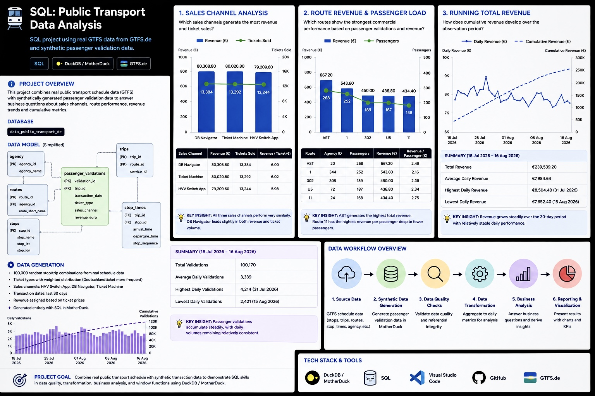

# SQL: Public Transport Data Analysis



SQL portfolio project based on public GTFS data from [GTFS.de](https://gtfs.de/), combined with synthetically generated passenger validation data and analyzed using DuckDB / MotherDuck.

The project demonstrates SQL techniques for **data quality validation, data transformation, business analysis, and window functions** using public transport schedule data.

**Database:** `data_public_transport_de`

---

## Project Overview

The project combines real GTFS schedule data with synthetically generated passenger validation data.

The analysis follows a simple data workflow:

```text
GTFS schedule data
        |
        v
Synthetic passenger validation data
        |
        v
Data quality checks
        |
        v
Data transformation
        |
        v
Business analysis
        |
        v
Window function analysis
```

The project focuses on both technical SQL skills and business-oriented analysis of public transport data.

---

## Data Generation

The `passenger_validations` table contains **synthetically generated passenger validation data** created in **MotherDuck**.

The generation process uses real `stop_times` data as a foundation:

- 100,000 random stop/trip combinations are sampled from the real schedule data.
- Ticket types are randomly assigned, with `Deutschlandticket` intentionally weighted more heavily.
- Sales channels are randomly assigned between `HVV Switch App`, `DB Navigator`, and `Ticket Machine`.
- Transaction dates are generated randomly within the previous 30 days.
- Revenue is assigned based on predefined ticket prices.

This approach combines **real public transport schedule data** with **synthetic transaction data**, allowing the project to demonstrate realistic analytical use cases without relying on confidential passenger transaction records.

The synthetic data was generated using SQL in **MotherDuck**.

---

## Tech Stack

- **Query Engine:** DuckDB / MotherDuck
- **Language:** SQL
- **Data Model:** Relational model with fact, dimension, and bridge tables
- **Data Source:** Public GTFS data from GTFS.de
- **Development:** Visual Studio Code
- **Version Control:** Git / GitHub

---

## SQL Skills Demonstrated

### Data Quality

- Duplicate detection with `GROUP BY` and `HAVING`
- Referential integrity checks
- `LEFT JOIN` for identifying unmatched records
- NULL validation

### Data Transformation

- Common Table Expressions (`WITH`)
- Aggregation with `COUNT()` and `SUM()`
- Transformation from transaction-level data to daily-level metrics
- Data preparation for downstream analysis

### Business Analysis

- Filtering with `WHERE` and `NOT LIKE`
- Grouping and sorting with `GROUP BY` and `ORDER BY`
- Relational joins with `INNER JOIN`
- Multi-table analysis
- KPI calculation
- Revenue and passenger-volume analysis

### Window Functions

- `SUM() OVER()`
- Cumulative metrics
- Running totals over time

### Data Analysis

- Business-oriented KPI analysis
- Data visualization
- Interpretation of analytical results
- Working with GTFS-based public transport data
- DuckDB / MotherDuck SQL

---

## SQL Project Structure

```text
sql/
├── 01_data_quality.sql
├── 02_data_transformation.sql
├── 03_business_analysis.sql
└── 04_window_functions.sql
```

### `01_data_quality.sql`

Contains data quality checks for the synthetic passenger validation data.

The queries check for:

- Duplicate `validation_id` values
- Passenger validations referencing a non-existent `trip_id`

Example:

```sql
SELECT
    pv.validation_id,
    pv.trip_id
FROM passenger_validations AS pv
LEFT JOIN trips AS t
    ON pv.trip_id = t.trip_id
WHERE t.trip_id IS NULL;
```

This identifies **orphan records** and demonstrates a referential integrity check using `LEFT JOIN`.

---

### `02_data_transformation.sql`

Transforms transaction-level passenger validation data into daily aggregated metrics.

The query calculates:

- Number of validations per day
- Daily revenue

```sql
WITH daily_validations AS (
    SELECT
        transaction_date,
        COUNT(*) AS validation_count,
        SUM(revenue_euro) AS revenue
    FROM passenger_validations
    GROUP BY transaction_date
)

SELECT
    transaction_date,
    validation_count,
    revenue
FROM daily_validations
ORDER BY transaction_date;
```

This demonstrates how detailed transactional data can be transformed into a dataset suitable for further analysis.

---

### `03_business_analysis.sql`

Contains three business-oriented SQL questions.

#### Business Question 1

**Which sales channels generate the most revenue and ticket sales?**

The analysis compares:

- Total revenue
- Total ticket sales
- Sales channels

Deutschlandticket transactions are excluded because they generate zero direct revenue in the synthetic dataset.

#### Business Question 2

**Which routes show the strongest commercial performance based on passenger validations and revenue?**

The analysis joins:

- `routes`
- `trips`
- `agency`
- `passenger_validations`

It identifies the top five routes by total revenue and compares passenger volume with revenue.

#### Business Question 3

**How does cumulative revenue develop over the observation period?**

A CTE first calculates daily revenue, followed by a window function to calculate the running total.

---

## 1. Sales Channel Analysis

### Business Question

Which sales channels generate the most revenue and ticket sales, excluding Deutschlandticket transactions?

### SQL

```sql
SELECT
    pv.sales_channel,
    SUM(revenue_euro) AS total_revenue,
    COUNT(ticket_type) AS total_tickets_sold
FROM passenger_validations AS pv
WHERE ticket_type NOT LIKE '%Deutschlandticket%'
  AND revenue_euro IS NOT NULL
GROUP BY pv.sales_channel
ORDER BY total_revenue DESC;
```

### Results

| Sales channel | Revenue (€) | Tickets sold | Revenue / ticket (€) |
|---|---:|---:|---:|
| DB Navigator | 80,308.80 | 13,384 | 6.00 |
| Ticket Machine | 80,020.80 | 13,292 | 6.02 |
| HVV Switch App | 79,209.60 | 13,244 | 5.98 |


### Key Insight

The three sales channels perform very similarly. **DB Navigator** has the highest total revenue (€80,308.80) and the highest number of tickets sold (13,384), but the differences between channels are small.

Revenue per ticket is also almost identical, ranging from approximately €5.98 to €6.02.

This indicates that differences in total revenue are primarily driven by **ticket volume rather than substantial differences in average ticket value**.

---

## 2. Route Revenue & Passenger Load

### Business Question

Which routes show the strongest commercial performance based on passenger validations and ticket revenue?

> **Note:** This analysis measures passenger volume and revenue. It does not calculate profitability because operating costs are not included.

### SQL

```sql
SELECT
    r.route_short_name,
    r.agency_id,
    COUNT(pv.validation_id) AS total_passengers,
    SUM(pv.revenue_euro) AS total_revenue
FROM routes AS r
INNER JOIN trips AS t
    ON r.route_id = t.route_id
INNER JOIN agency AS a
    ON r.agency_id = a.agency_id
INNER JOIN passenger_validations AS pv
    ON pv.trip_id = t.trip_id
GROUP BY r.route_short_name, r.agency_id
ORDER BY total_revenue DESC
LIMIT 5;
```

### Results

| Route | Agency ID | Passengers | Revenue (€) | Revenue / passenger (€) |
|---|---:|---:|---:|---:|
| AST | 20 | 268 | 667.20 | 2.49 |
| 1 | 344 | 252 | 543.60 | 2.16 |
| 302 | 309 | 189 | 450.00 | 2.38 |
| U5 | 72 | 187 | 436.80 | 2.34 |
| 11 | 24 | 158 | 434.40 | 2.75 |


### Key Insight

**AST** is the strongest route in the selected top five, generating €667.20 from 268 passenger validations.

Route 11 has fewer passenger validations but the highest revenue per passenger (€2.75). This demonstrates why total revenue and revenue efficiency should be considered separately when evaluating route performance.

---

## 3. Running Total Revenue

### Business Question

How does cumulative revenue develop over the observation period?

### SQL

```sql
WITH DailyRevenue AS (
    SELECT
        transaction_date,
        SUM(revenue_euro) AS daily_revenue
    FROM passenger_validations
    WHERE ticket_type NOT LIKE '%Deutschlandticket%'
    GROUP BY transaction_date
)

SELECT
    transaction_date,
    daily_revenue,
    SUM(daily_revenue) OVER (
        ORDER BY transaction_date
    ) AS running_total_revenue
FROM DailyRevenue
ORDER BY transaction_date;
```

### Results

The query returns **30 daily observations** from **18 July 2026 to 16 August 2026**.

- **Total revenue:** €239,539.20
- **Average daily revenue:** €7,984.64
- **Highest daily revenue:** €8,504.40 on 31 July 2026
- **Lowest daily revenue:** €7,652.40 on 15 August 2026


### Key Insight

Revenue accumulates steadily throughout the 30-day observation period, reaching **€239,539.20** by 16 August 2026.

Daily revenue remains relatively stable, with a limited difference between the highest and lowest observed days.

The window function:

```sql
SUM(daily_revenue) OVER (
    ORDER BY transaction_date
)
```

calculates the cumulative revenue chronologically.

---

## Window Function Analysis

The project also contains a separate window-function query in `04_window_functions.sql`.

### Business Question

How many passenger validations have accumulated over time?

### SQL

```sql
WITH daily_validations AS (
    SELECT
        transaction_date,
        COUNT(*) AS validation_count
    FROM passenger_validations
    GROUP BY transaction_date
)

SELECT
    transaction_date,
    validation_count,
    SUM(validation_count) OVER (
        ORDER BY transaction_date
    ) AS cumulative_validations
FROM daily_validations
ORDER BY transaction_date;
```

This demonstrates the use of `SUM() OVER()` to calculate a **cumulative metric across an ordered time series**.

The query separates daily aggregation from cumulative analysis:

```text
Passenger validations
        |
        v
Daily validation count
        |
        v
Cumulative validation count
```

---

## Data & Tools

**Data source:** [GTFS.de](https://gtfs.de/)

**Query engine:** DuckDB / MotherDuck

**Database:** `data_public_transport_de`

**Environment:** Visual Studio Code

**Version control:** Git / GitHub

---

## Project Structure

```text
.
├── README.md
├── sql/
│   ├── 01_data_quality.sql
│   ├── 02_data_transformation.sql
│   ├── 03_business_analysis.sql
│   └── 04_window_functions.sql
├── sales_channel_analysis.png
├── route_revenue_analysis.png
└── running_total_revenue.png
```

---

## Conclusion

This project demonstrates how SQL can be used across several stages of a data workflow, from **data quality validation and transformation to business analysis and analytical window functions**.

The project demonstrates:

- Data quality and referential integrity checks
- Transaction-to-daily data transformation
- Multi-table relational analysis
- Business-oriented KPI analysis
- Cumulative metrics using window functions
- Working with real GTFS schedule data
- Combining real source data with synthetically generated transaction data
- DuckDB / MotherDuck SQL

The combination of technical SQL processing and business-oriented analysis provides a practical example of working with structured data in a modern analytical SQL environment.